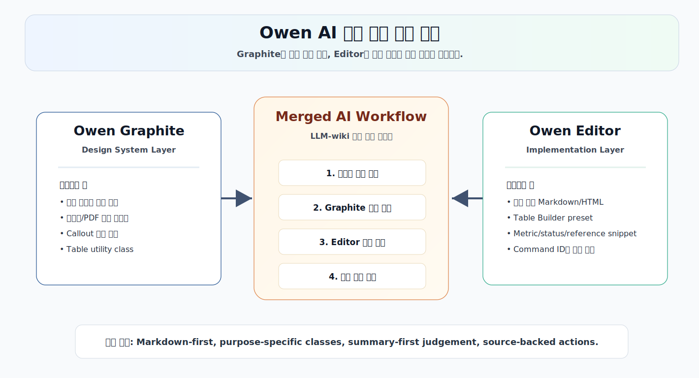
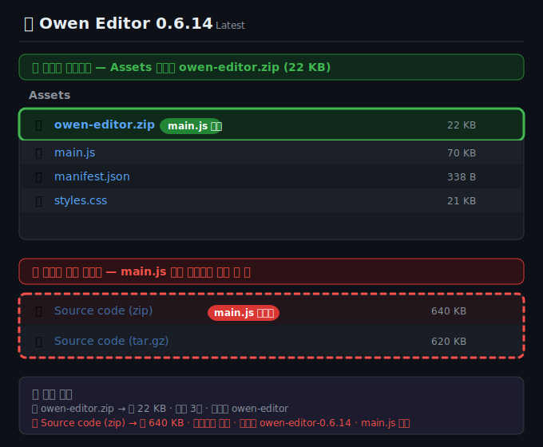

# Owen Editor





Owen Editor는 Obsidian에서 Markdown 편집을 빠르게 처리하기 위한 커뮤니티 플러그인입니다. 글쓰기, 리서치, 보고서 작성, 표 변환, Owen Graphite 테마용 문서 조각 삽입을 하나의 가벼운 편집 툴바로 묶습니다.


## 최신 업데이트

### v0.6.18

- README를 한국어 기준으로 다시 작성했습니다.
- Obsidian 커뮤니티 플러그인 리뷰 기준에 맞춰 UI 문구를 sentence case로 정리했습니다.
- SVG 필터의 정적 스타일을 `element.style` 직접 할당 대신 CSS 클래스로 옮겼습니다.
- Obsidian popout 창 호환성을 위해 문서 접근을 `activeDocument` 기준으로 정리했습니다.
- `eslint-plugin-obsidianmd` 기반의 로컬 검증 스크립트 `npm run lint:obsidian`을 추가했습니다.
- 저장된 설정 데이터가 예상과 다른 형태여도 기본 설정으로 안전하게 복구하도록 보강했습니다.
- Windows 환경에 `zip` 실행 파일이 없어도 릴리즈 zip을 만들 수 있도록 `Compress-Archive` fallback을 추가했습니다.

### v0.6.17

- command palette에 방향키 이동과 Enter 실행을 추가했습니다.
- 선택 툴바 위치 계산을 `requestAnimationFrame`으로 묶어 스크롤과 선택 변경 중 layout 작업을 줄였습니다.
- CI workflow와 Obsidian vault 동기화 스크립트를 추가했습니다.
- README 릴리즈 badge가 manifest 버전과 맞는지 release check에서 검사합니다.

### v0.6.16

- 플로팅 툴바와 선택 미니 툴바의 액체 유리 스타일을 SVG 렌즈 필터, 하이라이트, 라이트/다크 레이어 중심으로 개선했습니다.

## 설치

커뮤니티 플러그인 등록이 완료되면 Obsidian의 `Community plugins` 브라우저에서 `Owen Editor`를 검색해 설치할 수 있습니다.

### 수동 zip 설치

> **주의: GitHub의 `Source code (zip)`을 받지 마세요.** 이 파일은 소스코드 아카이브라서 Obsidian 플러그인 실행에 필요한 `main.js`가 들어 있지 않습니다. GitHub 릴리스 페이지의 **Assets** 섹션에서 `owen-editor.zip`을 다운로드해야 합니다.



1. [owen-editor.zip 다운로드](https://github.com/towishy/owen-editor/releases/latest/download/owen-editor.zip)를 엽니다.
2. 압축을 풀어 `owen-editor` 폴더를 만듭니다.
3. Obsidian 볼트의 `.obsidian/plugins/` 폴더를 엽니다.
4. `owen-editor` 폴더를 `.obsidian/plugins/` 안으로 복사합니다.
5. 아래 파일 3개가 `owen-editor` 폴더 바로 아래에 있는지 확인합니다.

```text
.obsidian/plugins/owen-editor/main.js
.obsidian/plugins/owen-editor/manifest.json
.obsidian/plugins/owen-editor/styles.css
```

zip 파일을 `.obsidian/plugins/` 안에 그대로 두면 플러그인이 로드되지 않습니다. `.obsidian/plugins/owen-editor/owen-editor/main.js`처럼 폴더가 한 단계 더 중첩된 구조도 피해야 합니다.

Obsidian을 다시 시작하거나 플러그인을 다시 로드한 뒤 `Owen Editor`를 활성화하세요.

## 주요 기능

- Markdown 편집용 플로팅 글래스 툴바
- 선택한 텍스트 근처에 나타나는 선택 미니 툴바
- 선택 영역, Markdown 표, 코드 블록, Graphite 보고서 문맥에 맞춰 바뀌는 context-aware 툴바
- 위/아래 위치 전환, 접기 모드, 밀도 설정, 모바일 compact 모드
- minimal, writer, report, full, custom 툴바 preset
- 자주 쓰는 명령을 툴바에 고정하는 favorite 기능과 favorite preset
- 실행한 명령을 다시 찾기 쉬운 recent commands
- 굵게, 기울임, 취소선, 밑줄, 하이라이트, 제목, 들여쓰기, 목록, 체크박스, 실행 취소, 다시 실행
- 링크, wiki link, embed, attachment, image, footnote 삽입
- callout, frontmatter, Mermaid block, 코드 블록, 인용, 정렬 도우미
- Markdown 표와 Owen Graphite HTML 표를 만드는 table builder
- CSV, TSV, Markdown 표 선택 영역을 Markdown 표 또는 Graphite HTML 표로 변환
- executive summary, comparison report, risk review, meeting review 문서 template
- frontmatter, wide table, risk table, numeric table, risk matrix, reference list, status badge, kbd, blur, Graphite callout snippet
- A3/PDF 문서에 맞춘 source note, metric row, decision matrix snippet
- 한국어와 영어 검색 alias를 지원하는 command palette

## 사용 방법

Obsidian에서 Markdown 노트를 열면 설정에 따라 플로팅 툴바가 편집 영역에 표시됩니다. 왼쪽의 기본 편집 버튼으로 자주 쓰는 Markdown 서식을 적용하고, 오른쪽의 카테고리 버튼으로 기능별 palette를 엽니다.

| 카테고리 | 제공 기능 |
| --- | --- |
| Selection | 텍스트 서식, 주석, callout, 인용, 코드 블록, 선택 영역 감싸기 |
| Links | Markdown link, wiki link, embed, attachment, image, footnote |
| Blocks | 구분선, frontmatter, Mermaid block, 정렬, 문서 block |
| Tables | Markdown 표, table builder, Graphite 표 preset |
| Owen graphite | Graphite 보고서, 표, callout, badge, blur, keyboard, reference helper |
| All commands | Owen Editor 전체 명령 palette |

Obsidian 기본 command palette에서도 Owen Editor 명령을 사용할 수 있습니다. Owen Editor palette 검색은 `table`, `표`, `링크`, `highlight`, `강조`, `graphite`, `보고서` 같은 영어와 한국어 키워드를 함께 처리합니다.

전체 명령 palette에서 별 버튼을 누르면 자주 쓰는 명령을 플로팅 툴바에 고정할 수 있습니다. 설정 탭에서는 favorite 순서를 바꾸거나 preset을 적용할 수 있습니다.

텍스트를 선택하면 선택 미니 툴바가 나타납니다. 굵게, 기울임, 하이라이트, 링크, Graphite kbd, Graphite blur처럼 선택 영역에 바로 적용하는 명령을 빠르게 실행할 수 있습니다. 미니 툴바는 현재 Markdown pane 안에 머물며, 위쪽 공간이 부족하면 선택 영역 아래로 이동합니다.

표가 필요하면 Tables palette에서 table builder를 엽니다. 행/열 수를 직접 지정하거나 CSV/TSV 데이터를 붙여넣어 표를 만들 수 있고, 삽입 전 Markdown 또는 HTML 결과를 미리 확인할 수 있습니다.

## Owen Graphite 테마 안내

기본 Markdown 편집 명령은 어떤 Obsidian 테마에서도 동작합니다. 다만 `wide-table`, `risk-table`, `ogd-status-badge`, `ogd-reference-list` 같은 Owen Graphite 전용 class가 들어간 snippet은 Owen Graphite 테마가 활성화되어 있을 때 의도한 스타일로 표시됩니다.

Owen Graphite 테마가 없어도 삽입되는 Markdown과 HTML은 읽을 수 있는 형태로 남습니다. 테마 전용 시각 효과만 적용되지 않습니다.

## AI 작성 가이드

LLM-wiki나 AI 문서 작성 워크플로에서 Owen Editor와 Owen Graphite 출력 규칙을 맞추려면 [docs/llm-wiki-owen-editor-ai-guide.md](docs/llm-wiki-owen-editor-ai-guide.md)를 사용하세요. 이 문서는 명령과 Markdown 문법, Graphite class, 보고서 frontmatter, callout, 표 preset, 재사용 가능한 prompt 지침을 연결합니다.

## Palette 레이아웃 샘플

v0.6.6 이후 command palette는 긴 명령 이름, preview chip, code snippet이 좁은 레이아웃에서도 카드 밖으로 넘치지 않도록 정리되어 있습니다.


## 설정

- Show floating glass toolbar: 가로 편집 툴바를 표시합니다.
- Show selection mini toolbar: 선택한 텍스트 근처에 미니 툴바를 표시합니다.
- Show status bar button: 상태바에서 editor palette를 빠르게 열 수 있게 합니다.
- Toolbar position: 툴바를 편집기 위쪽 또는 아래쪽에 배치합니다.
- Toolbar preset: minimal, writer, report, full, custom 레이아웃을 적용합니다.
- Toolbar density: compact, balanced, comfortable, custom 밀도를 적용합니다.
- Start with toolbar collapsed: 시작 시 툴바를 한 개 버튼으로 접어 둡니다.
- Toolbar scale: 플로팅 툴바와 선택 미니 툴바 크기를 80%에서 110% 사이로 조정합니다.
- Favorite row display: favorite 행을 항상 표시, hover/focus 시 표시, 숨김 중에서 선택합니다.
- Compact toolbar on mobile: 모바일에서 버튼 크기를 줄이고 줄바꿈을 허용합니다.
- Context-aware toolbar: 선택 영역, 표, 코드 블록, 보고서 문맥에 맞춰 명령 그룹을 바꿉니다.
- Command feedback: 명령 실행 후 툴바 버튼을 짧게 강조합니다.
- Prefer owen graphite HTML tables: 지원되는 표 preset에서 Graphite class가 들어간 HTML 표를 우선 삽입합니다.
- Warn when owen graphite is not active: Graphite 전용 snippet 사용 시 테마가 비활성 상태이면 한 번 안내합니다.
- Favorite presets: writer, research, report, table-heavy favorite 구성을 적용합니다.
- Toolbar favorites: 툴바에 고정할 명령 ID를 저장합니다.
- Favorite order: 고정된 명령을 위아래로 이동하거나 제거합니다.
- Settings JSON: 툴바 설정을 내보내고 다른 볼트나 기기로 가져옵니다.

## 개발

```bash
npm install
npm run lint:obsidian
npm run build
npm run docs:screenshot
npm run release:check
npm run release:preflight
```

Windows PowerShell에서 `npm.ps1` 실행 정책에 막히면 `npm.cmd run build`처럼 `npm.cmd`를 사용하세요.

개발 중 자동 rebuild가 필요하면 아래 명령을 사용합니다.

```bash
npm run dev
```

## 릴리즈 절차

릴리즈 전에는 다음 항목을 확인합니다.

- `CHANGELOG.md`의 `Unreleased` 내용을 새 버전 섹션으로 옮깁니다.
- `package.json`, `package-lock.json`, `manifest.json`, `versions.json`의 버전을 맞춥니다.
- 편집 명령, 문서 template, Graphite snippet, table helper가 바뀌면 [docs/llm-wiki-owen-editor-ai-guide.md](docs/llm-wiki-owen-editor-ai-guide.md)를 함께 검토합니다.
- `npm run lint:obsidian`으로 Obsidian 커뮤니티 리뷰 기준을 미리 점검합니다.
- `npm run release:preflight`로 build, release check, diff check, zip asset 생성을 검증합니다.
- changelog와 asset이 준비된 뒤에만 `npm run release:create`를 실행합니다.

`npm run release:check`는 버전 정렬, release asset, license, README preview image, 현재 manifest 버전의 changelog 항목을 확인합니다.

## 저장소

[https://github.com/towishy/owen-editor](https://github.com/towishy/owen-editor)
