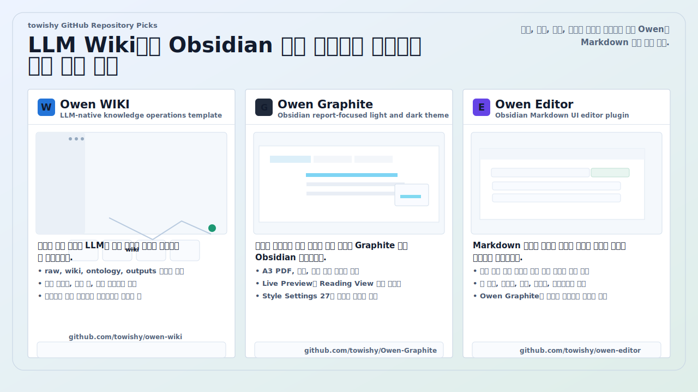
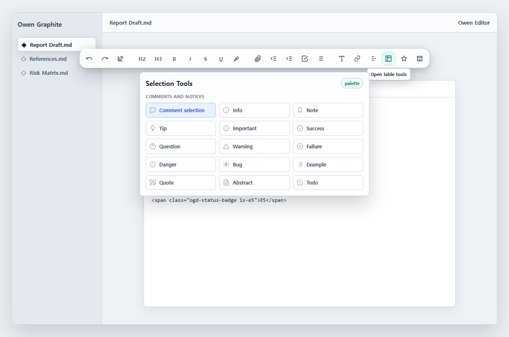
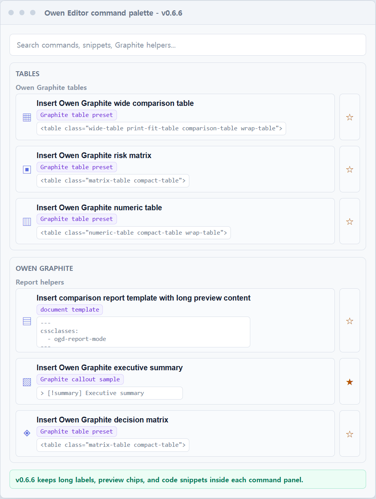

Owen Editor is part of a Markdown-based knowledge work stack that connects LLM-ready wiki operations, the Owen Graphite Obsidian theme, and a fast Obsidian editing toolbar.

# Owen Editor

Owen Editor is an Obsidian plugin that brings a practical Markdown editing toolbar together with quick helpers for the Owen Graphite theme.



## Features

- Floating glass toolbar for common Markdown editing actions.
- Selection mini toolbar for quick inline formatting near selected text.
- Smart selection toolbar placement that avoids editor edges and flips below selected text when needed.
- Toolbar position controls for top or bottom placement, with collapsible, density, and context-aware toolbar states.
- Toolbar presets for minimal, writer, report, full, and custom workflows.
- Context-aware toolbar groups for selected text, tables, fenced code blocks, and Owen Graphite report notes.
- Direct buttons for undo, redo, headings, bold, italic, strikethrough, underline, highlight, indent, outdent, tasks, and lists.
- Category palettes for selection tools, links, blocks, tables, Owen Graphite helpers, and all commands, including Korean and English search aliases.
- Palette sections emphasize search context, recent commands, grouped browsing, and small output previews for commands that insert visible Graphite or Markdown snippets.
- Highlight color picker with recommended soft colors for selected text.
- Favorites that pin frequently used commands directly onto the floating toolbar, with display modes for always visible, hover reveal, or hidden rows.
- Expanded Obsidian callout support, including note, info, tip, important, success, question, warning, failure, danger, bug, example, quote, abstract, and todo.
- Table builder with live preview, custom row/column counts, and CSV/TSV paste conversion.
- Table builder inference for pasted data, including header detection, uneven row normalization, and numeric column alignment.
- Document templates for executive summaries, comparison reports, risk reviews, and meeting notes.
- Table helpers for basic Markdown tables and Owen Graphite report table presets.
- Owen Graphite snippets for report frontmatter, wide comparison tables, risk tables, numeric tables, risk matrices, reference lists, keyboard tags, blur spans, status badges, and theme callouts.
- A3/PDF-friendly Owen Graphite snippets for source notes, metric rows, and decision matrices.

## v0.6.6 Palette Layout Sample

Version 0.6.6 keeps long command labels, preview chips, and code snippets inside each command panel on dense palette layouts.



## Owen Graphite Theme Notice

The standard Markdown editing commands work in any Obsidian vault. Owen Graphite-specific helpers insert Markdown or HTML snippets designed for the Owen Graphite theme, so their visual styling requires the Owen Graphite theme to be installed and enabled in Obsidian.

Without Owen Graphite, those snippets are still inserted as readable Markdown or HTML, but theme-specific classes such as `wide-table`, `risk-table`, `ogd-status-badge`, and `ogd-reference-list` will not receive the intended visual treatment.

## Usage

Enable Owen Editor from Obsidian's Community Plugins settings, then open a Markdown note. The floating toolbar appears near the top of the editor when the plugin setting is enabled. You can move it to the bottom or collapse it into a single button from the settings tab.

Use the left side of the toolbar for frequent edits such as headings, formatting, highlights, indentation, tasks, and lists. Use the colored category icons on the right side to open focused palettes:

| Icon Group | Palette |
|---|---|
| Selection | Text styling, comments, notices, quotes, code blocks, and selection wrappers |
| Links | Markdown links, wiki links, embeds, attachments, images, and footnotes |
| Blocks | Horizontal rules, frontmatter, Mermaid blocks, alignment helpers, and document blocks |
| Tables | Markdown tables and Owen Graphite table presets |
| Owen Graphite | Theme-specific report, table, callout, badge, blur, keyboard, and reference helpers |
| All Commands | Full Owen Editor command palette |

Most commands are also available from Obsidian's command palette under `Owen Editor`. Palette search accepts common English and Korean terms such as `table`, `표`, `링크`, `highlight`, `강조`, `graphite`, and `보고서`.

Open the all-commands palette and use the star buttons to pin frequent actions to the glass toolbar. Pinned commands appear between the common Markdown controls and the category icons.

Recent commands appear above the grouped command list after you use commands. Use the settings tab to reorder pinned favorites, remove items, or apply a toolbar preset.

Select text in the editor to show the selection mini toolbar near the highlighted text. It provides quick access to bold, italic, highlight, link, Owen Graphite kbd, and Owen Graphite blur actions without moving to the fixed toolbar. The mini toolbar stays within the active Markdown pane and flips below the selection when there is not enough room above it.

Use the table builder from the Tables palette when you need a custom number of rows and columns. The builder shows the generated Markdown or HTML before insertion and can convert pasted CSV or TSV data. Markdown output works in any vault; Owen Graphite presets insert theme-classed HTML for report-ready tables.

## Settings

- Show floating glass toolbar: toggles the horizontal editor toolbar.
- Show selection mini toolbar: shows inline formatting tools near selected text.
- Show status bar button: adds an `Owen Editor` status bar shortcut.
- Toolbar position: pins the toolbar to the top or bottom of the editor.
- Toolbar preset: applies minimal, writer, report, full, or custom toolbar layouts.
- Toolbar density: applies compact, balanced, comfortable, or custom toolbar density settings.
- Start with toolbar collapsed: keeps the toolbar as a compact single-button launcher until expanded.
- Toolbar scale: adjusts the floating toolbar and selection mini toolbar size from 80% to 110%, with automatic downscaling in narrow document panes.
- Favorite row display: shows pinned favorite commands always, on toolbar hover/focus, or hides the row.
- Compact toolbar on mobile: reduces button size and allows wrapping on mobile devices.
- Context-aware toolbar: changes the visible toolbar command groups based on selection, table, code block, or report context.
- Command feedback: briefly highlights toolbar buttons after a command runs.
- Prefer Owen Graphite HTML tables: inserts HTML tables with Owen Graphite classes instead of plain Markdown table fallbacks for supported table presets.
- Warn when Owen Graphite is not active: shows a one-time notice before inserting theme-specific snippets if the Owen Graphite theme is not active.
- Toolbar favorites: stores command IDs pinned to the floating toolbar. This is usually managed with the star buttons in the palette.
- Favorite order: move pinned commands up or down, or remove them without editing raw IDs.
- Settings JSON: export and import portable toolbar settings across vaults or devices.

Settings are grouped by toolbar behavior, selection tools, shortcuts, Graphite helpers, and favorites so the growing command surface stays easier to scan.

## Installation

After the plugin is accepted into Obsidian Community Plugins, install it from Obsidian's Community Plugins browser.

For manual installation, download the release assets and copy these files into `.obsidian/plugins/owen-editor/` in your vault:

- `main.js`
- `manifest.json`
- `styles.css`

Restart Obsidian or reload plugins, then enable `Owen Editor`.

## Development

```bash
npm install
npm run build
npm run release:check
npm run release:preflight
```

## Release Process

Before every release:

- Move completed notes from `CHANGELOG.md` `Unreleased` into a new version section.
- Update `package.json`, `package-lock.json`, `manifest.json`, and `versions.json` to the same version.
- Run `npm run release:preflight`.
- Use `npm run release:create` only after the changelog entry and release assets are ready.

`npm run release:check` verifies version alignment, release assets, license, README preview image, and the changelog entry for the current manifest version.

For live rebuilds during plugin development:

```bash
npm run dev
```

## Repository

https://github.com/towishy/owen-editor
