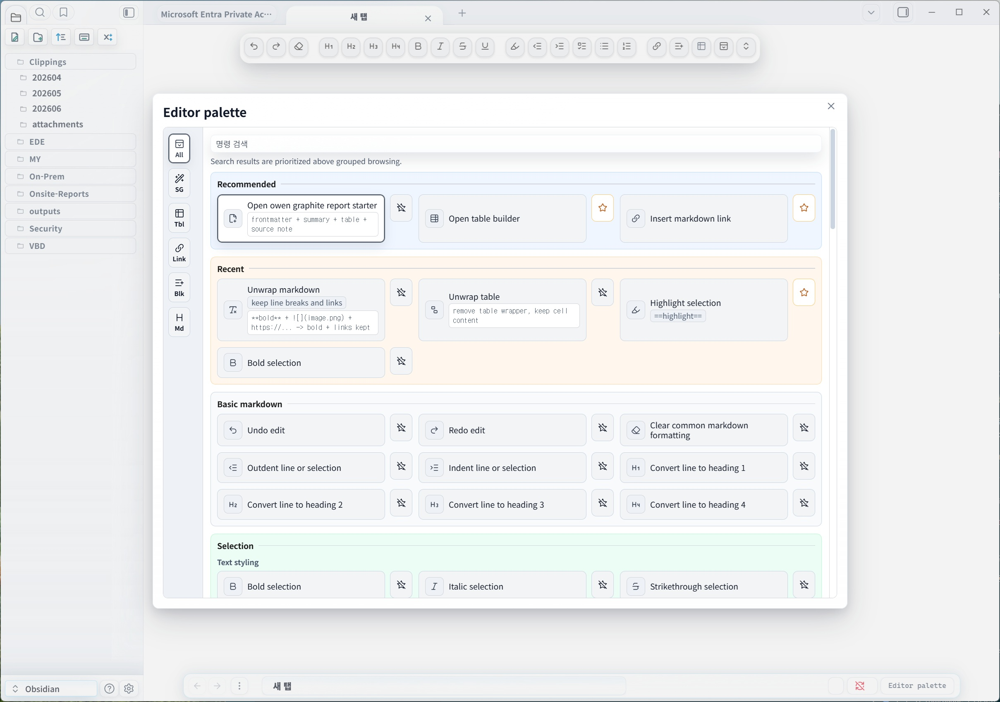
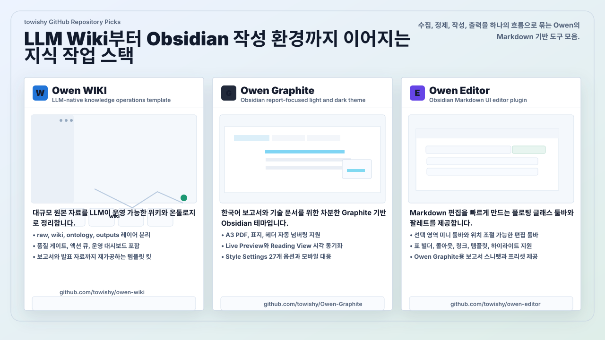
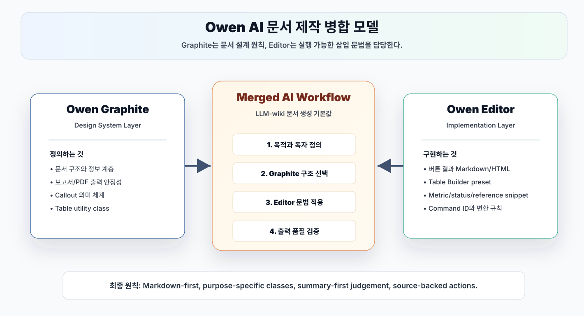
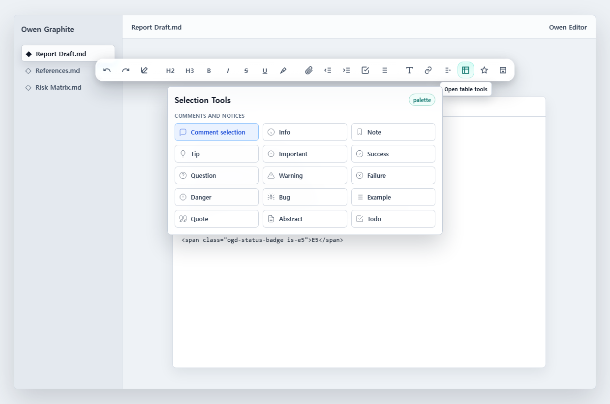
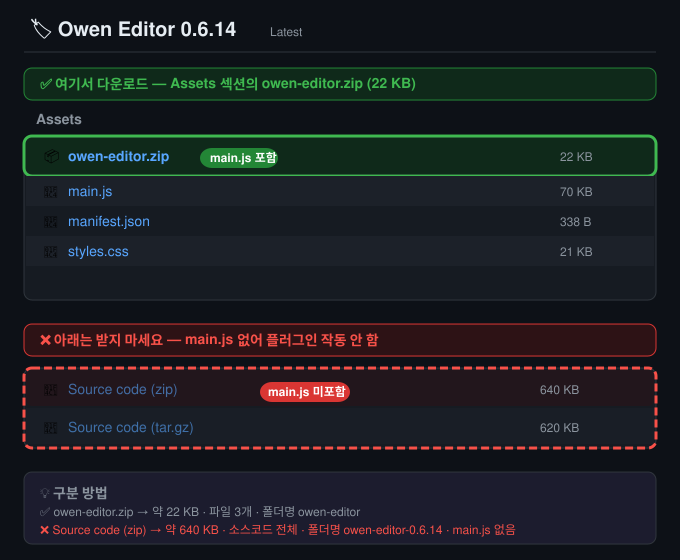
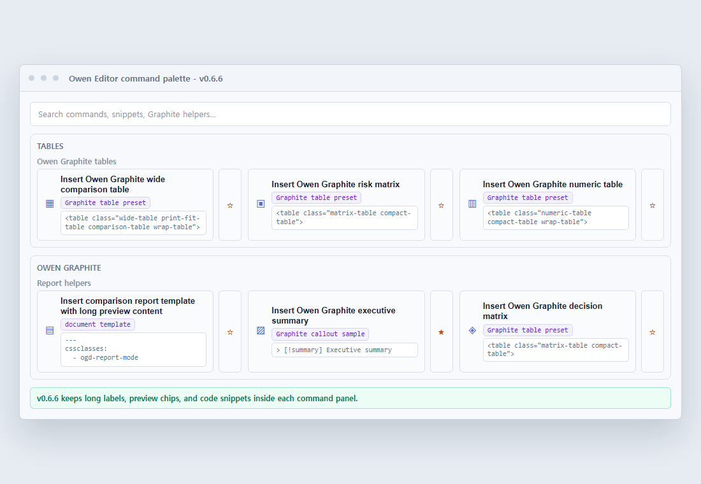

# Owen Editor








Owen Editor is an Obsidian community plugin for fast Markdown editing. It brings writing, research, report drafting, table conversion, and Owen Graphite theme snippets into one lightweight editing toolbar.

> **Language:** Owen Editor follows Obsidian by default: Korean uses Korean, while every other locale uses English. Override it from **Settings → Owen Editor → Interface → Language**.



## Latest updates

### v0.6.27

- Added complete English and Korean interface catalogs for settings, commands, notices, menus, and dialogs.
- Added an Interface language setting that follows Obsidian automatically while allowing explicit English or Korean overrides.

### v0.6.26

- Restyled the editor palette with a cool neutral canvas, layered white command surfaces, restrained shadows, and quieter neutral selection states.
- Replaced the search field's accent focus rim with a subtle boundary treatment and stabilized compact command labels across host and mobile font settings.

### v0.6.25

- Reorganized the floating toolbar into clearer history, context, collection, and utility groups with larger effective control targets.
- Added accessible native heading and More menus while removing duplicate primary and favorite commands.
- Rebuilt the editor palette as an opaque quiet workbench with sticky search, a semantic category rail, section counts, keyboard navigation, and boundary-only liquid glass.

### v0.6.24

- Refined the editor palette with blue-gray liquid glass command cards, softer outlines, clearer menu text, and stronger section spacing.
- Added distinct hover, favorite, and Owen Graphite table preset color states for easier scanning.
- Kept favorite actions inside each command card so palette rows read as single controls.

### v0.6.23

- Added H1 and unwrap table actions to the editor toolbar for faster Markdown cleanup workflows.
- Added an unwrap markdown action that preserves links and images while removing formatting, HTML highlights, and stray `<br>` tags.
- Reworked the command palette with a category rail, clearer section bands, stronger panel visibility, and scrollable content.
- Kept the selection toolbar closer to the recent mouse position when selecting large document ranges.

### v0.6.22

- Replaced the `builtin-modules` dependency with the native `node:module` `builtinModules` import to match Obsidian reviewer guidance.
- Pinned the `obsidian` devDependency to `~1.5.0` and added `engines.node >= 18` so automated builds run in the expected runtime.
- Replaced the toolbar row `:has(...)` z-index selector with plain `:hover` and `:focus-within` selectors to avoid broad selector invalidation.
- Stopped publishing the bundled `owen-editor.zip` release asset. GitHub releases now publish `main.js`, `manifest.json`, and `styles.css` directly.
- Added a GitHub Actions release workflow with build provenance attestation for the published plugin assets.

### v0.6.21

- Refined the resting state of toolbar buttons so the liquid glass style is lighter and closer to the shared CodePen reference.
- Improved bottom toolbar tooltip placement, favorite settings, mobile selection context updates, and table builder source controls.
- Updated the README UI preview and palette overflow sample images to match the current interface.

### v0.6.20

- Replaced the first README introduction image with a bright modern mockup that shows the real Owen WIKI, Owen Graphite, and Owen Editor workflow.

### v0.6.19

- Kept tooltips for central toolbar icons above the second-row favorite buttons during hover and focus states.

### v0.6.18

- Rebuilt the README with current installation, usage, settings, validation, and release guidance.
- Updated UI copy to follow Obsidian community plugin sentence-case expectations.
- Moved static SVG filter styling from direct `element.style` assignments into CSS classes.
- Switched editor document access to `activeDocument` for better Obsidian popout compatibility.
- Added local ReviewBot-style validation with `eslint-plugin-obsidianmd` and `npm run lint:obsidian`.
- Hardened saved settings loading so unexpected data falls back to default settings safely.
- Added a Windows `Compress-Archive` fallback for release automation when the `zip` executable is unavailable.

## Installation

After Owen Editor is listed in the Obsidian community plugin browser, you can install it by searching for `Owen Editor` under `Community plugins`.

### Manual installation

> **Do not download GitHub's `Source code (zip)` archive.** That archive contains the repository source, not the built Obsidian plugin files. Download `main.js`, `manifest.json`, and `styles.css` from the release **Assets** section instead.



1. Open the [latest Owen Editor release](https://github.com/towishy/owen-editor/releases/latest).
2. Download all three files from **Assets**: `main.js`, `manifest.json`, and `styles.css`.
3. Create an `owen-editor` folder inside your vault's `.obsidian/plugins/` folder.
4. Place the three downloaded files directly inside that folder.
5. Confirm that the folder has this structure.

```text
.obsidian/plugins/owen-editor/main.js
.obsidian/plugins/owen-editor/manifest.json
.obsidian/plugins/owen-editor/styles.css
```

Avoid nested folders such as `.obsidian/plugins/owen-editor/owen-editor/main.js`.

Restart Obsidian or reload plugins, then enable `Owen Editor`.

## Key features

- Floating glass toolbar for Markdown editing.
- Selection mini toolbar that appears near selected text.
- Context-aware toolbar groups for selections, Markdown tables, code blocks, and Graphite report contexts.
- Top and bottom toolbar placement, collapsed mode, density controls, and compact mobile layout.
- Minimal, writer, report, full, and custom toolbar presets.
- Favorite commands and favorite presets for pinning frequent actions to the toolbar.
- Recent commands so repeated actions stay easy to find.
- Bold, italic, strikethrough, underline, highlight, headings, indentation, lists, checkboxes, undo, and redo.
- Insert helpers for Markdown links, wiki links, embeds, attachments, images, and footnotes.
- Callouts, frontmatter, Mermaid blocks, code blocks, block quotes, and alignment helpers.
- Table builder for Markdown tables and Owen Graphite HTML tables.
- Selection conversion from CSV, TSV, or Markdown tables into Markdown tables or Graphite HTML tables.
- Document templates for executive summaries, comparison reports, risk reviews, and meeting reviews.
- Owen Graphite snippets for frontmatter, wide tables, risk tables, numeric tables, risk matrices, reference lists, status badges, kbd tags, blur spans, and Graphite callouts.
- A3 and PDF-oriented snippets for source notes, metric rows, and decision matrices.
- Command palette search aliases in English and Korean.

## Usage

Open a Markdown note in Obsidian and the floating toolbar appears in the editor according to your settings. Use the primary editing buttons on the left for common Markdown formatting, then open feature palettes from the category buttons on the right.

| Category | Features |
| --- | --- |
| Selection | Text formatting, comments, callouts, block quotes, code blocks, and selection wrappers |
| Links | Markdown links, wiki links, embeds, attachments, images, and footnotes |
| Blocks | Dividers, frontmatter, Mermaid blocks, alignment helpers, and document blocks |
| Tables | Markdown tables, table builder, and Graphite table presets |
| Owen Graphite | Graphite reports, tables, callouts, badges, blur, keyboard tags, and reference helpers |
| All commands | The full Owen Editor command palette |

You can also run Owen Editor commands from Obsidian's built-in command palette. Owen Editor palette search accepts English keywords such as `table`, `link`, `highlight`, `graphite`, and `report`, along with their Korean equivalents.

In the full command palette, press the star button to pin frequently used commands to the floating toolbar. The settings tab also lets you reorder favorites or apply a favorite preset.

When you select text, the selection mini toolbar appears near the selection. It gives quick access to commands such as bold, italic, highlight, link, Graphite kbd, and Graphite blur. The mini toolbar stays inside the active Markdown pane and flips below the selection when there is not enough room above it.

Open the Tables palette when you need a table. The table builder can create tables from row and column counts or from pasted CSV or TSV data, and it previews the Markdown or HTML result before insertion.

## Owen Graphite theme notes

The core Markdown editing commands work in any Obsidian theme. Snippets that use Owen Graphite-specific classes, such as `wide-table`, `risk-table`, `ogd-status-badge`, and `ogd-reference-list`, render with their intended visual style when the Owen Graphite theme is active.

Without the Owen Graphite theme, inserted Markdown and HTML remain readable. Only the theme-specific visual treatment is omitted.

## AI writing guide

Use [docs/llm-wiki-owen-editor-ai-guide.md](docs/llm-wiki-owen-editor-ai-guide.md) when you want LLM-wiki or AI writing workflows to match Owen Editor and Owen Graphite output rules. The guide connects commands, Markdown syntax, Graphite classes, report frontmatter, callouts, table presets, and reusable prompt instructions.

## Palette layout sample

Since v0.6.6, the command palette keeps long command names, preview chips, and code snippets inside their cards even in narrow or dense layouts.



## Settings

- Show floating glass toolbar: Shows the horizontal editing toolbar.
- Show selection mini toolbar: Shows the mini toolbar near selected text.
- Show status bar button: Adds a status bar entry for opening the editor palette quickly.
- Toolbar position: Places the toolbar at the top or bottom of the editor.
- Toolbar preset: Applies the minimal, writer, report, full, or custom layout.
- Toolbar density: Applies compact, balanced, comfortable, or custom spacing.
- Start with toolbar collapsed: Opens the toolbar as a single collapsed button.
- Toolbar scale: Resizes the floating toolbar and selection mini toolbar from 80% to 110%.
- Favorite row display: Shows favorites always, only on hover or focus, or keeps them hidden.
- Compact toolbar on mobile: Reduces button sizes and allows wrapping on mobile.
- Context-aware toolbar: Changes command groups for selections, tables, code blocks, and report contexts.
- Command feedback: Briefly highlights toolbar buttons after a command runs.
- Prefer owen graphite HTML tables: Inserts Graphite-class HTML tables first when a supported table preset allows it.
- Warn when owen graphite is not active: Shows a one-time notice when a Graphite-specific snippet is used without the theme active.
- Favorite presets: Applies writer, research, report, or table-heavy favorite sets.
- Add favorite command: Adds a pinned toolbar command from the dropdown.
- Favorite order: Moves pinned commands up or down, or removes them.
- Settings JSON: Exports toolbar settings and imports them into another vault or device.

## Development

```bash
npm install
npm run lint:obsidian
npm run build
npm run docs:screenshot
npm run release:check
npm run release:preflight
```

If Windows PowerShell blocks `npm.ps1`, use `npm.cmd`, such as `npm.cmd run build`.

Use this command when you want automatic rebuilds during development.

```bash
npm run dev
```

## Release process

Before a release, check these items.

- Move `CHANGELOG.md` `Unreleased` entries into a new version section.
- Keep versions aligned in `package.json`, `package-lock.json`, `manifest.json`, and `versions.json`.
- Review [docs/llm-wiki-owen-editor-ai-guide.md](docs/llm-wiki-owen-editor-ai-guide.md) when editing commands, document templates, Graphite snippets, or table helpers.
- Run `npm run lint:obsidian` to catch Obsidian community review issues early.
- Run `npm run release:preflight` to validate the build, release checks, clean diff requirements, and release assets.
- Run `npm run release:create` only after the changelog and assets are ready.

`npm run release:check` validates version alignment, release assets, license metadata, README preview images, and the changelog section for the current manifest version.

## Sponsorship

<p align="center">
  <a href="https://github.com/sponsors/towishy">
    
  </a>
</p>

## Repository

[https://github.com/towishy/owen-editor](https://github.com/towishy/owen-editor)