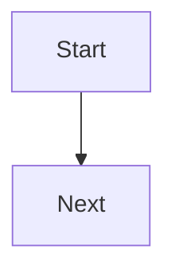

# Owen Editor AI Guide for LLM-wiki

> [!summary] 핵심 목적
> 이 문서는 LLM-wiki가 Obsidian 문서를 생성할 때 Owen Editor와 Owen Graphite 조합에 맞는 Markdown, HTML snippet, callout, table class를 일관되게 사용하도록 돕는 작성 가이드다.

## 적용 대상

LLM-wiki가 다음 환경으로 문서를 작성할 때 이 문서를 우선 참고한다.

- Obsidian vault에서 문서를 작성한다.
- Obsidian 테마는 Owen Graphite를 사용한다.
- 편집 보조 도구는 Owen Editor를 사용한다.
- 출력 문서는 Markdown 원문으로도 읽기 쉬워야 하고, Live Preview와 PDF/print에서도 무너지지 않아야 한다.

## AI 작성 원칙

1. 문서의 기본 골격은 순수 Markdown으로 작성한다.
2. Owen Graphite 전용 시각 요소가 필요한 곳에만 HTML snippet과 CSS class를 사용한다.
3. 보고서, 비교표, 리스크 검토, 의사결정 문서에는 frontmatter의 `cssclasses`를 적극 사용한다.
4. 표는 목적에 맞는 class를 명확히 지정한다. 넓은 비교표는 `wide-table`, 리스크 표는 `risk-table`, 숫자 중심 표는 `numeric-table`을 사용한다.
5. 긴 URL, 긴 식별자, 코드 토큰이 표 안에 들어가면 `wrap-table` 또는 별도 본문 설명으로 분리한다.
6. 문서 상단에는 독자가 먼저 판단할 수 있는 summary callout을 둔다.
7. 결론, 근거, 표, 권장 조치, 출처 순서로 배치한다.
8. AI가 실제 Owen Editor 버튼을 누를 수 없는 상황에서는 Owen Editor가 삽입하는 결과 문법을 직접 생성한다.

## 기본 문서 흐름

보고서형 문서는 아래 흐름을 기본값으로 사용한다.

```markdown
---
title: 문서 제목
tags:
  - report
cssclasses:
  - ogd-report-mode
  - ogd-modern-tables
  - ogd-print-avoid-breaks
---

# 문서 제목

> [!summary] 핵심 결론
> 의사결정자가 먼저 봐야 할 결론을 3문장 이내로 작성한다.

## Key Findings

- 핵심 발견 1:
- 핵심 발견 2:
- 핵심 발견 3:

## Analysis

본문 분석을 작성한다.

## Recommendation

- Owner:
- Due date:
- Next step:

## Sources

<p class="table-source">Source: 자료명, 2026.</p>
```

## Owen Editor 기능 매핑

Owen Editor 명령을 사용할 수 있으면 해당 명령을 사용하고, 직접 생성해야 하면 오른쪽 문법을 사용한다.

<table class="wide-table print-fit-table comparison-table wrap-table">
  <thead>
    <tr>
      <th>목적</th>
      <th>Owen Editor 기능</th>
      <th>AI가 직접 생성할 문법</th>
      <th>사용 기준</th>
    </tr>
  </thead>
  <tbody>
    <tr>
      <td>굵게</td>
      <td>Bold selection</td>
      <td><code>**중요 문장**</code></td>
      <td>핵심 단어 또는 짧은 판단 강조</td>
    </tr>
    <tr>
      <td>기울임</td>
      <td>Italic selection</td>
      <td><code>*보조 설명*</code></td>
      <td>용어, 뉘앙스, 참고 표현</td>
    </tr>
    <tr>
      <td>취소선</td>
      <td>Strikethrough selection</td>
      <td><code>~~폐기된 선택지~~</code></td>
      <td>대안 비교에서 제외된 항목</td>
    </tr>
    <tr>
      <td>밑줄</td>
      <td>Underline selection</td>
      <td><code>&lt;u&gt;확인 필요&lt;/u&gt;</code></td>
      <td>Markdown 기본 강조보다 강한 주의 표시가 필요할 때</td>
    </tr>
    <tr>
      <td>인라인 코드</td>
      <td>Inline code selection</td>
      <td><code>`policy-id`</code></td>
      <td>명령어, 파일명, 클래스명, 식별자</td>
    </tr>
    <tr>
      <td>기본 하이라이트</td>
      <td>Highlight selection</td>
      <td><code>==중요 문장==</code></td>
      <td>Obsidian 호환성이 가장 중요할 때</td>
    </tr>
    <tr>
      <td>색상 하이라이트</td>
      <td>Highlight color picker</td>
      <td><code>&lt;mark style="background-color: #dbeafe; color: #1e3a8a;"&gt;정보&lt;/mark&gt;</code></td>
      <td>정보, 위험, 완료 상태를 색으로 구분할 때</td>
    </tr>
    <tr>
      <td>링크</td>
      <td>Insert markdown link</td>
      <td><code>[문서명](https://example.com/)</code></td>
      <td>외부 자료 연결</td>
    </tr>
    <tr>
      <td>Wiki 링크</td>
      <td>Insert wiki link</td>
      <td><code>[[Page]]</code></td>
      <td>Vault 내부 문서 연결</td>
    </tr>
    <tr>
      <td>첨부 임베드</td>
      <td>Insert attachment embed</td>
      <td><code>![[attachment.png]]</code></td>
      <td>Vault 첨부 이미지나 파일 삽입</td>
    </tr>
    <tr>
      <td>이미지 임베드</td>
      <td>Insert image embed</td>
      <td><code></code></td>
      <td>외부 또는 상대경로 이미지 삽입</td>
    </tr>
    <tr>
      <td>각주</td>
      <td>Insert footnote reference</td>
      <td><code>문장[^1]</code>, <code>[^1]: 출처 설명</code></td>
      <td>본문 흐름을 깨지 않고 근거를 달 때</td>
    </tr>
    <tr>
      <td>키보드 키</td>
      <td>Wrap selection with owen graphite keyboard tag</td>
      <td><code>&lt;kbd&gt;Cmd+K&lt;/kbd&gt;</code></td>
      <td>단축키, 키 입력 설명</td>
    </tr>
    <tr>
      <td>비공개/흐림 텍스트</td>
      <td>Wrap selection with owen graphite blur</td>
      <td><code>&lt;span class="ogd-blur"&gt;비공개 내용&lt;/span&gt;</code></td>
      <td>민감 정보나 선택적으로 보일 내용</td>
    </tr>
  </tbody>
</table>

## Callout 사용 규칙

Obsidian callout은 문서의 판단 구조를 빠르게 스캔하게 만든다. 일반 callout은 표준 Obsidian 문법을 사용하고, Owen Graphite 전용 callout은 아래 패턴을 사용한다.

<table class="risk-table compact-table">
  <thead>
    <tr>
      <th>Callout</th>
      <th>용도</th>
      <th>권장 위치</th>
      <th>상태</th>
    </tr>
  </thead>
  <tbody>
    <tr>
      <td><code>[!summary]</code></td>
      <td>핵심 결론, executive summary</td>
      <td>문서 최상단</td>
      <td class="risk-ok">Default</td>
    </tr>
    <tr>
      <td><code>[!action]</code></td>
      <td>담당자, 기한, 다음 단계</td>
      <td>권장 조치 섹션</td>
      <td class="risk-ok">Default</td>
    </tr>
    <tr>
      <td><code>[!warning]</code></td>
      <td>주의 사항, 제한 조건</td>
      <td>리스크 또는 검토 섹션</td>
      <td class="risk-medium">Use carefully</td>
    </tr>
    <tr>
      <td><code>[!danger]</code></td>
      <td>높은 위험, 차단 사항</td>
      <td>중대한 리스크 섹션</td>
      <td class="risk-high">High signal only</td>
    </tr>
    <tr>
      <td><code>[!secret]</code></td>
      <td>제한 공개 또는 hover 공개 내용</td>
      <td>민감 정보가 있는 단락</td>
      <td class="risk-medium">Sensitive</td>
    </tr>
  </tbody>
</table>

### 기본 Callout 예시

```markdown
> [!summary] Executive summary
> 핵심 판단과 근거를 간결하게 정리한다.

> [!action] Action items
> - 담당자:
> - 기한:
> - 다음 단계:

> [!warning] 주의
> 확인이 필요한 제약 조건을 작성한다.

> [!danger] 위험
> 높은 위험이나 차단 사항을 작성한다.

> [!secret] Restricted
> hover 시 표시할 내용을 입력한다.
```

### 표준 Obsidian Callout 목록

Owen Editor는 다음 callout 삽입을 지원한다. LLM-wiki는 문맥에 맞춰 같은 문법을 직접 생성해도 된다.

```markdown
> [!note] 공지
> 공유할 내용을 입력한다.

> [!info] 정보
> 참고 정보를 입력한다.

> [!tip] 팁
> 작업에 도움이 되는 힌트를 입력한다.

> [!important] 중요
> 반드시 확인해야 할 내용을 입력한다.

> [!success] 성공
> 완료되었거나 긍정적인 내용을 입력한다.

> [!question] 질문
> 확인이 필요한 질문을 입력한다.

> [!failure] 실패
> 실패 원인과 후속 조치를 입력한다.

> [!bug] 버그
> 문제 증상과 재현 조건을 입력한다.

> [!example] 예시
> 예시 내용을 입력한다.

> [!quote] 인용
> 인용문이나 원문을 입력한다.

> [!abstract] 요약
> 핵심 내용을 짧게 요약한다.

> [!todo] 할 일
> - 담당자:
> - 기한:
> - 다음 단계:
```

## 표 작성 규칙

표는 목적에 따라 Markdown 표와 Owen Graphite HTML 표를 나누어 사용한다.

- 간단한 3열 이하 정보: Markdown 표 사용
- 비교 항목이 많거나 PDF 출력이 필요한 표: HTML 표 + `wide-table print-fit-table comparison-table wrap-table`
- 리스크 목록: HTML 표 + `risk-table compact-table`
- 수치 비교: HTML 표 + `numeric-table print-fit-table`, 숫자 셀에는 `class="num"`
- 가능성/영향도 매트릭스: HTML 표 + `matrix-table compact-table`
- 긴 URL/ID/토큰: `wrap-table`을 추가하거나 표 밖 본문으로 분리

### 넓은 비교표

```html
<table class="wide-table print-fit-table comparison-table wrap-table">
  <thead>
    <tr>
      <th>항목</th>
      <th>설명</th>
      <th>식별자</th>
      <th class="num">점수</th>
      <th>권장 조치</th>
    </tr>
  </thead>
  <tbody>
    <tr>
      <td>Baseline</td>
      <td>핵심 기준을 요약한다.</td>
      <td><code>policy-id</code></td>
      <td class="num">95.2%</td>
      <td>후속 조치를 기록한다.</td>
    </tr>
  </tbody>
</table>

<p class="table-source">Source, 2026.</p>
```

### 리스크 표

```html
<table class="risk-table compact-table">
  <thead>
    <tr>
      <th>리스크</th>
      <th>영향</th>
      <th>완화책</th>
      <th>상태</th>
    </tr>
  </thead>
  <tbody>
    <tr>
      <td>예외 정책 누락</td>
      <td>추적성이 낮아질 수 있음</td>
      <td>예외 목록을 appendix로 분리</td>
      <td class="risk-high">High</td>
    </tr>
    <tr>
      <td>긴 URL overflow</td>
      <td>모바일과 PDF에서 폭이 밀릴 수 있음</td>
      <td><code>wrap-table</code> 적용</td>
      <td class="risk-medium">Medium</td>
    </tr>
    <tr>
      <td>숫자 컬럼 가독성</td>
      <td>비교가 어려워질 수 있음</td>
      <td><code>numeric-table</code> 적용</td>
      <td class="risk-ok">OK</td>
    </tr>
  </tbody>
</table>
```

### 숫자 표

```html
<table class="numeric-table print-fit-table">
  <thead>
    <tr>
      <th>월</th>
      <th>요청</th>
      <th>완료</th>
      <th>성공률</th>
      <th>평균 처리일</th>
    </tr>
  </thead>
  <tbody>
    <tr><td>2026-01</td><td class="num">1,204</td><td class="num">1,178</td><td class="num">97.84%</td><td class="num">2.4</td></tr>
    <tr><td>2026-02</td><td class="num">982</td><td class="num">951</td><td class="num">96.84%</td><td class="num">2.8</td></tr>
  </tbody>
</table>
```

### 리스크 매트릭스

```html
<table class="matrix-table compact-table">
  <thead>
    <tr>
      <th>영향도 \ 가능성</th>
      <th>Low</th>
      <th>Medium</th>
      <th>High</th>
    </tr>
  </thead>
  <tbody>
    <tr><td>High</td><td class="risk-medium">M</td><td class="risk-high">H</td><td class="risk-high">H</td></tr>
    <tr><td>Medium</td><td class="risk-low">L</td><td class="risk-medium">M</td><td class="risk-high">H</td></tr>
    <tr><td>Low</td><td class="risk-low">L</td><td class="risk-low">L</td><td class="risk-medium">M</td></tr>
  </tbody>
</table>
```

## 보고서 전용 스니펫

### Report Frontmatter

PDF, A3, 긴 표 출력이 예상되면 아래 frontmatter를 사용한다.

```yaml
---
title: 보고서 제목
date: 2026-04-30
tags:
  - report
cssclasses:
  - ogd-report-mode
  - ogd-page-a3-land
  - ogd-modern-tables
  - ogd-print-avoid-breaks
cover: true
---
```

### Metric Row

핵심 KPI를 문서 초반 또는 요약 뒤에 배치할 때 사용한다.

```html
<div class="ogd-metric-row">
  <div class="ogd-metric-card"><strong>95%</strong><span>Coverage</span></div>
  <div class="ogd-metric-card"><strong>12</strong><span>Open risks</span></div>
  <div class="ogd-metric-card"><strong>3</strong><span>Next actions</span></div>
</div>
```

### Decision Matrix

여러 선택지를 비용, 리스크, 적합도로 비교하고 최종 결정을 남길 때 사용한다.

```html
<table class="matrix-table compact-table print-fit-table">
  <thead>
    <tr><th>Option</th><th>Fit</th><th>Risk</th><th>Cost</th><th>Decision</th></tr>
  </thead>
  <tbody>
    <tr><td>Baseline</td><td>High</td><td class="risk-low">Low</td><td class="num">1x</td><td>Adopt</td></tr>
    <tr><td>Advanced</td><td>Medium</td><td class="risk-medium">Medium</td><td class="num">1.6x</td><td>Phase 2</td></tr>
  </tbody>
</table>
```

### Reference List

출처가 여러 개인 분석 문서에서는 단순 bullet보다 reference list를 사용한다.

```html
<p class="ogd-reference-summary">주요 참고 자료를 출처, 문서명, 설명으로 분리한다.</p>
<ol class="ogd-reference-list">
  <li>
    <span class="ogd-reference-source">Source</span>
    <div class="ogd-reference-main">
      <a class="ogd-reference-title" href="https://example.com/">Document title</a>
      <p>핵심 근거와 연결 맥락을 한 문장으로 정리한다.</p>
    </div>
  </li>
</ol>
```

### Status Badge

제품 플랜, 지원 상태, 범주 태그처럼 짧은 상태를 표시할 때 사용한다.

```html
<span class="ogd-status-badge is-e5">E5</span>
<span class="ogd-status-badge is-payg">PAYG</span>
<span class="ogd-status-badge is-addon">Add-on</span>
```

## 문서 유형별 추천 패턴

<table class="wide-table print-fit-table comparison-table wrap-table">
  <thead>
    <tr>
      <th>문서 유형</th>
      <th>권장 시작점</th>
      <th>주요 구성</th>
      <th>추천 Owen Editor 기능</th>
    </tr>
  </thead>
  <tbody>
    <tr>
      <td>Executive summary</td>
      <td><code>insert-template-executive-summary</code></td>
      <td>summary callout, key findings, recommendation</td>
      <td>summary callout, action callout, metric row</td>
    </tr>
    <tr>
      <td>Comparison report</td>
      <td><code>insert-template-comparison-report</code></td>
      <td>비교 기준, wide comparison table, notes, recommendation</td>
      <td>wide table, decision matrix, source note</td>
    </tr>
    <tr>
      <td>Risk review</td>
      <td><code>insert-template-risk-review</code></td>
      <td>risk table, mitigation plan, owner, follow-up</td>
      <td>risk table, matrix table, warning/danger callout</td>
    </tr>
    <tr>
      <td>Meeting review</td>
      <td><code>insert-template-meeting-review</code></td>
      <td>agenda, decisions, action items</td>
      <td>task list, action callout, wiki links</td>
    </tr>
    <tr>
      <td>Research note</td>
      <td>Markdown 기본 문서</td>
      <td>question, findings, evidence, references</td>
      <td>wiki link, footnote, reference list, highlight</td>
    </tr>
  </tbody>
</table>

## Table Builder와 CSV/TSV 변환 규칙

Owen Editor의 Table Builder는 Markdown, wide, risk, numeric preset을 지원한다. LLM-wiki가 표 데이터를 생성할 때는 아래 규칙을 따른다.

- CSV 또는 TSV 입력을 표로 바꿀 때 첫 행이 숫자가 아닌 제목 행이고 뒤 행에 숫자가 있으면 header로 취급한다.
- 행마다 열 수가 다르면 빈 셀로 보정한다.
- 숫자만 있는 열은 Markdown 표에서 오른쪽 정렬 구분자 `---:`를 사용한다.
- HTML numeric table에서는 숫자 셀에 `class="num"`을 넣는다.
- Graphite table 변환이 필요한 데이터는 `wide-table print-fit-table comparison-table wrap-table`을 기본값으로 사용한다.

## Mermaid와 코드 블록

Owen Editor는 Mermaid block과 code block 삽입을 지원한다. LLM-wiki는 다이어그램이 필요한 경우 Markdown 코드 펜스를 명확히 닫는다.

````markdown

````

코드 예시는 언어명을 반드시 붙인다.

````markdown
```typescript
const value = "example";
```
````

## 하이라이트 색상 기준

색상 하이라이트가 필요한 경우 Owen Editor의 highlight picker와 같은 색상 계열을 사용한다.

<table class="compact-table">
  <thead>
    <tr>
      <th>상황</th>
      <th>배경</th>
      <th>글자색</th>
      <th>예시</th>
    </tr>
  </thead>
  <tbody>
    <tr><td>중요</td><td><code>#fef3c7</code></td><td><code>#1f2937</code></td><td><mark style="background-color: #fef3c7; color: #1f2937;">중요 문장</mark></td></tr>
    <tr><td>완료/긍정</td><td><code>#d1fae5</code></td><td><code>#064e3b</code></td><td><mark style="background-color: #d1fae5; color: #064e3b;">완료</mark></td></tr>
    <tr><td>정보/참고</td><td><code>#dbeafe</code></td><td><code>#1e3a8a</code></td><td><mark style="background-color: #dbeafe; color: #1e3a8a;">참고</mark></td></tr>
    <tr><td>위험/주의</td><td><code>#ffe4e6</code></td><td><code>#9f1239</code></td><td><mark style="background-color: #ffe4e6; color: #9f1239;">주의</mark></td></tr>
    <tr><td>아이디어</td><td><code>#ede9fe</code></td><td><code>#4c1d95</code></td><td><mark style="background-color: #ede9fe; color: #4c1d95;">아이디어</mark></td></tr>
    <tr><td>중립</td><td><code>#e5e7eb</code></td><td><code>#111827</code></td><td><mark style="background-color: #e5e7eb; color: #111827;">중립 강조</mark></td></tr>
  </tbody>
</table>

## LLM-wiki용 작성 체크리스트

문서 생성이 끝나면 아래 항목을 확인한다.

- H1은 문서 주제를 직접 말한다.
- 첫 화면 안에 summary callout이 있다.
- 표는 목적에 맞는 class를 사용한다.
- 숫자 컬럼은 오른쪽 정렬 또는 `class="num"`을 사용한다.
- 출처가 필요한 표 아래에는 `table-source` 또는 reference list가 있다.
- action item에는 담당자, 기한, 다음 단계가 있다.
- 긴 URL과 식별자는 표 레이아웃을 깨지 않도록 `wrap-table` 또는 별도 문단을 사용한다.
- Graphite 전용 HTML snippet은 닫는 태그가 빠지지 않았다.
- Obsidian Live Preview에서 읽을 수 있도록 Markdown 원문도 과하게 복잡하지 않다.

## AI 시스템 프롬프트용 축약 지침

LLM-wiki 시스템 프롬프트나 프로젝트 지침에는 아래 블록을 그대로 넣을 수 있다.

```markdown
Obsidian 문서를 작성할 때 Owen Editor/Owen Graphite 스타일을 따른다. 문서는 H1, summary callout, 본문 섹션, 표/근거, recommendation/action items 순서로 작성한다. 보고서형 문서에는 frontmatter의 cssclasses에 `ogd-report-mode`, `ogd-modern-tables`, 필요 시 `ogd-print-avoid-breaks`와 `ogd-page-a3-land`를 넣는다. 비교표는 `<table class="wide-table print-fit-table comparison-table wrap-table">`, 리스크 표는 `<table class="risk-table compact-table">`, 숫자 표는 `<table class="numeric-table print-fit-table">`를 사용하고 숫자 셀에는 `class="num"`을 붙인다. 핵심 결론은 `> [!summary]`, 실행 항목은 `> [!action]`, 주의/위험은 `> [!warning]` 또는 `> [!danger]` callout으로 작성한다. 출처는 `<p class="table-source">Source: ...</p>` 또는 `<ol class="ogd-reference-list">` 구조로 정리한다. 단축키는 `<kbd>Cmd+K</kbd>`, 민감 정보는 `<span class="ogd-blur">...</span>`, 상태 태그는 `<span class="ogd-status-badge ...">...</span>`를 사용한다.
```

## Command ID 참고

Owen Editor 내부 명령 ID를 명시해야 하는 자동화나 설정에서는 아래 값을 참고한다.

<table class="compact-table wrap-table">
  <thead>
    <tr>
      <th>그룹</th>
      <th>Command IDs</th>
    </tr>
  </thead>
  <tbody>
    <tr>
      <td>기본 편집</td>
      <td><code>undo-edit</code>, <code>redo-edit</code>, <code>clear-formatting-selection</code>, <code>heading-2</code>, <code>heading-3</code>, <code>heading-4</code>, <code>toggle-task</code>, <code>insert-bulleted-list</code>, <code>insert-numbered-list</code>, <code>indent-lines</code>, <code>outdent-lines</code></td>
    </tr>
    <tr>
      <td>선택 영역</td>
      <td><code>bold-selection</code>, <code>italic-selection</code>, <code>strikethrough-selection</code>, <code>underline-selection</code>, <code>inline-code-selection</code>, <code>mark-selection</code>, <code>blockquote-selection</code>, <code>code-block-selection</code>, <code>comment-selection</code></td>
    </tr>
    <tr>
      <td>링크/참조</td>
      <td><code>insert-link</code>, <code>insert-wikilink</code>, <code>insert-attachment-link</code>, <code>insert-image-embed</code>, <code>insert-footnote-reference</code></td>
    </tr>
    <tr>
      <td>블록</td>
      <td><code>insert-horizontal-rule</code>, <code>insert-frontmatter-block</code>, <code>insert-mermaid-block</code>, <code>insert-align-center-html</code>, <code>insert-align-right-html</code></td>
    </tr>
    <tr>
      <td>표</td>
      <td><code>insert-markdown-table</code>, <code>open-table-builder</code>, <code>convert-selection-to-markdown-table</code>, <code>convert-selection-to-graphite-table</code>, <code>insert-graphite-wide-table</code>, <code>insert-graphite-risk-table</code>, <code>insert-graphite-numeric-table</code>, <code>insert-graphite-matrix-table</code></td>
    </tr>
    <tr>
      <td>Owen Graphite</td>
      <td><code>open-graphite-report-starter</code>, <code>insert-template-executive-summary</code>, <code>insert-template-comparison-report</code>, <code>insert-template-risk-review</code>, <code>insert-template-meeting-review</code>, <code>insert-graphite-report-frontmatter</code>, <code>wrap-graphite-kbd</code>, <code>wrap-graphite-blur</code>, <code>insert-graphite-secret-callout</code>, <code>insert-graphite-summary-callout</code>, <code>insert-graphite-action-callout</code>, <code>insert-graphite-status-badge</code>, <code>insert-graphite-reference-list</code>, <code>insert-graphite-source-note</code>, <code>insert-graphite-metric-row</code>, <code>insert-graphite-decision-matrix</code></td>
    </tr>
  </tbody>
</table>